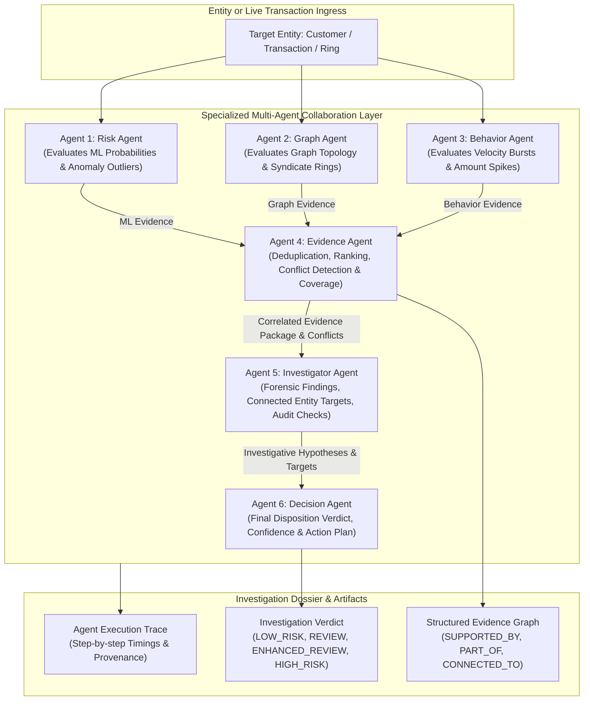

# FraudGraph Phase 6: Multi-Agent Collaborative Architecture

## 1. Executive Summary

FraudGraph Phase 6 transforms fraud investigation from manual forensic lookups into an **Autonomous Multi-Agent Collaborative Investigation System**. Rather than relying on a single monolithic black-box score or hallucinating generative models, FraudGraph orchestrates **6 specialized AI agents** operating in sequence.

Each agent possesses a strict mandate, operates exclusively on verified underlying system data (from Phases 1–5), produces traceable execution steps, and participates in transparent cross-agent debate and conflict resolution.

---

## 2. Multi-Agent Architecture & Flow Diagram



---

## 3. Specialized Agent Roles & Mandates

### 3.1 Agent 1 — Risk Agent (`RiskAgent`)
- **Mandate**: Evaluates Phase 3 machine-learning outputs without retraining.
- **Signals Evaluated**:
  - Supervised RandomForest fraud probability (`supervised_model_probability`).
  - Unsupervised IsolationForest anomaly score (`unsupervised_anomaly_score`).
  - Graph-vs-Baseline model uplift (`graph_model_prob - baseline_prob`).
- **Output**: ML risk tier, confidence, and model-attributed evidence items.

### 3.2 Agent 2 — Graph Agent (`GraphAgent`)
- **Mandate**: Evaluates Phase 2 heterogeneous graph linkages, shared infrastructure, and syndicates.
- **Signals Evaluated**:
  - Shared hardware device clusters (`shared_devices`).
  - Shared payment instrument collusion (`shared_payments`).
  - Shared proxy IP infrastructure (`shared_ips`).
  - Louvain syndicate community membership (`associated_ring_id`) and role (`CORE` vs `MEMBER`).
  - Network structural centrality risk (`network_risk_score`).
- **Output**: Graph risk tier, shared infrastructure counts, and topology evidence items.

### 3.3 Agent 3 — Behavior Agent (`BehaviorAgent`)
- **Mandate**: Analyzes transaction historical patterns and velocity dynamics.
- **Signals Evaluated**:
  - Temporal burst synchronization ($\le 180\text{s}$ interval between events).
  - Historical amount spikes (> ₹30,000 or $> 3.5\times$ historical mean).
  - Rapid device/IP hopping.
  - Protective factors: verified KYC identity, established account tenure (> 180 days).
- **Output**: Behavioral risk tier, burst count, and velocity evidence items.

### 3.4 Agent 4 — Evidence Agent (`EvidenceAgent`)
- **Mandate**: Aggregates, deduplicates, and ranks multi-agent evidence; performs conflict adjudication; computes data coverage.
- **Key Responsibilities**:
  1. **Deduplication & Ranking**: Merges identical signals, sorting from `CRITICAL` down to `LOW` by feature importance.
  2. **Conflict Detection**: Flags inter-agent disagreements (e.g. Model High vs Network Clean).
  3. **Evidence Coverage Score ($0.0 - 100.0\%$)**: Quantifies data completeness across ML, graph, and behavior sources.

### 3.5 Agent 5 — Investigator Agent (`InvestigatorAgent`)
- **Mandate**: Formulates objective forensic hypotheses, identifies linked entities to audit, and recommends checks.
- **Investigative Standards**:
  - Uses strictly neutral, evidence-grounded language (no unverified accusations).
  - Identifies priority hardware, card, and co-transacting neighbors for analyst review.

### 3.6 Agent 6 — Decision Agent (`DecisionAgent`)
- **Mandate**: Synthesizes the final investigation disposition, confidence rating, and recommended intervention.
- **Disposition Tiers**:
  - `HIGH_RISK`: Score $\ge 80.0$ or $\ge 1$ Critical / $\ge 3$ High severity signals.
  - `ENHANCED_REVIEW`: Score $\ge 60.0$ or $\ge 1$ High severity signal.
  - `REVIEW`: Score $\ge 35.0$ or active inter-agent conflict detected.
  - `LOW_RISK`: Score $< 35.0$ with clean baseline.

---

## 4. Conflict Adjudication Framework

In real-world fraud operations, different risk channels frequently diverge. FraudGraph explicitly exposes these disagreements:

| Conflict Type | Manifestation | Adjudication Action |
| :--- | :--- | :--- |
| **Model vs Network Discrepancy** | High ML fraud probability on an account with completely clean, isolated graph topology. | Triggers manual analyst review to inspect potential behavioral spoofing vs model false positive. |
| **Network vs Model Discrepancy** | Low transaction anomaly score on an account tied to a coordinated syndicate ring. | Flags stealth mule activity where transaction amounts remain artificially small to evade threshold filters. |
| **Velocity vs Tenure Tension** | Rapid velocity bursts observed on a mature, KYC-verified account. | Triggers account takeover (ATO) / credential stuffing audit. |

---

## 5. Evidence Coverage vs. Fraud Probability

> [!IMPORTANT]
> **Evidence Coverage ($0 - 100\%$) is NOT Fraud Probability ($0 - 100\%$)**.
> - **Risk Score / Fraud Probability**: The estimated statistical likelihood that an entity is engaged in fraudulent collusion.
> - **Evidence Coverage**: The completeness and multi-source corroboration of available data channels (ML, Graph, Velocity, KYC).
> 
> *Example*: A clean retail customer (`CUST_00803`) has a **Risk Score of 12.0/100 (LOW_RISK)** with an **Evidence Coverage of 90.0% (Complete Data Confidence)**.

---

## 6. Zero-Fabrication & Provenance Guarantees

Every evidence item conforms to the strict schema:
```json
{
  "signal": "shared_device_hardware_cluster",
  "source_agent": "GraphAgent",
  "severity": "CRITICAL",
  "value": 4,
  "importance": 0.35,
  "description": "Directly linked to 1 hardware device(s) shared across up to 4 accounts.",
  "category": "GRAPH_TOPOLOGY"
}
```
No agent is permitted to generate evidence ungrounded in underlying data structures.
