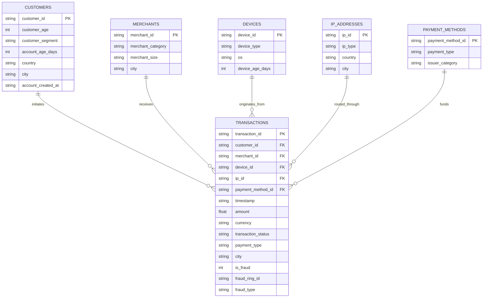

# FraudGraph Synthetic Dataset Documentation

## Overview

The FraudGraph dataset is a high-fidelity synthetic relational database modeling a digital payments and fintech ecosystem. It is specifically designed to evaluate graph-based and machine-learning-based fraud detection techniques against coordinated fraud rings.

The dataset contains six relational tables:
1. `customers.csv`
2. `transactions.csv`
3. `devices.csv`
4. `ip_addresses.csv`
5. `payment_methods.csv`
6. `merchants.csv`

---

## 1. Schema & Field Definitions

### 1.1 `customers.csv`
Contains customer profiles, account demographic data, and account lifecycle information.

| Column | Type | Description | Example |
| :--- | :--- | :--- | :--- |
| `customer_id` | String (PK) | Unique synthetic customer identifier | `CUST_00001` |
| `customer_age` | Integer | Customer age (18 to 75 years) | `34` |
| `customer_segment` | String | Account tier (`RETAIL`, `PREMIUM`, `STUDENT`, `SALARIED`, `SME`) | `SALARIED` |
| `account_age_days` | Integer | Number of days since account opening | `420` |
| `country` | String | ISO-2 country code (`IN`) | `IN` |
| `city` | String | Customer registered home city | `Bengaluru` |
| `account_created_at` | String (ISO) | Timestamp of account registration | `2025-01-06T14:22:10` |

---

### 1.2 `devices.csv`
Contains hardware and operating system fingerprints for client devices.

| Column | Type | Description | Example |
| :--- | :--- | :--- | :--- |
| `device_id` | String (PK) | Unique synthetic device fingerprint identifier | `DEV_0012` |
| `device_type` | String | Form factor (`MOBILE`, `DESKTOP`, `TABLET`) | `MOBILE` |
| `os` | String | Operating system (`Android`, `iOS`, `Windows`, `macOS`, `Linux`, `iPadOS`) | `Android` |
| `device_age_days` | Integer | First seen age of device in days | `310` |

---

### 1.3 `ip_addresses.csv`
Contains network origin identifiers, routing categories, and geographical mapping.

| Column | Type | Description | Example |
| :--- | :--- | :--- | :--- |
| `ip_id` | String (PK) | Unique synthetic IP address identifier | `IP_00045` |
| `ip_type` | String | Network category (`RESIDENTIAL`, `MOBILE_CARRIER`, `DATACENTER`, `VPN`, `PUBLIC_WIFI`) | `DATACENTER` |
| `country` | String | Origin country (`IN`, or international proxy `SG`, `US`, etc.) | `IN` |
| `city` | String | Resolved geolocation city | `Mumbai` |

---

### 1.4 `payment_methods.csv`
Contains synthetic payment instruments used to fund transactions.

| Column | Type | Description | Example |
| :--- | :--- | :--- | :--- |
| `payment_method_id` | String (PK) | Unique payment instrument identifier | `PM_0088` |
| `payment_type` | String | Payment channel (`UPI`, `CREDIT_CARD`, `DEBIT_CARD`, `NET_BANKING`, `WALLET`) | `UPI` |
| `issuer_category` | String | Instrument issuer (`PUBLIC_BANK`, `PRIVATE_BANK`, `FINTECH_WALLET`, `NEOBANK`, `INTERNATIONAL_CARD`) | `PRIVATE_BANK` |

> *Note: No real credit card numbers, CVVs, or bank account credentials are used or stored.*

---

### 1.5 `merchants.csv`
Contains merchant businesses accepting payments.

| Column | Type | Description | Example |
| :--- | :--- | :--- | :--- |
| `merchant_id` | String (PK) | Unique merchant business identifier | `MERCH_0023` |
| `merchant_category` | String | Business category (`ECOMMERCE`, `FOOD_DELIVERY`, `ELECTRONICS`, `TRAVEL`, `GAMING`, `JEWELRY`, etc.) | `ELECTRONICS` |
| `merchant_size` | String | Merchant scale (`SMALL`, `MEDIUM`, `LARGE`, `ENTERPRISE`) | `LARGE` |
| `city` | String | Merchant operating headquarters city | `Delhi` |

---

### 1.6 `transactions.csv`
Contains individual payment events and transactional linkages across all entities.

| Column | Type | Description | Example |
| :--- | :--- | :--- | :--- |
| `transaction_id` | String (PK) | Unique transaction identifier | `TXN_00142` |
| `customer_id` | String (FK) | Reference to `customers.customer_id` | `CUST_00012` |
| `merchant_id` | String (FK) | Reference to `merchants.merchant_id` | `MERCH_0023` |
| `device_id` | String (FK) | Reference to `devices.device_id` | `DEV_0012` |
| `ip_id` | String (FK) | Reference to `ip_addresses.ip_id` | `IP_00045` |
| `payment_method_id` | String (FK) | Reference to `payment_methods.payment_method_id` | `PM_0088` |
| `timestamp` | String (ISO) | Transaction timestamp (`YYYY-MM-DDTHH:MM:SS`) | `2026-02-14T18:34:12` |
| `amount` | Float | Transaction amount in INR | `14500.00` |
| `currency` | String | Currency code (`INR`) | `INR` |
| `transaction_status` | String | Transaction outcome (`SUCCESS`, `FAILED`, `PENDING`) | `SUCCESS` |
| `payment_type` | String | Payment channel utilized | `UPI` |
| `city` | String | Location of transaction execution | `Mumbai` |
| `is_fraud` | Integer (0/1) | **Ground-truth label** (1 = Fraud, 0 = Legitimate) | `1` |
| `fraud_ring_id` | String | **Ground-truth ring identifier** (`RING_01` .. `RING_07`, or empty for legit) | `RING_01` |
| `fraud_type` | String | **Ground-truth fraud archetype** (see taxonomy below, or empty for legit) | `shared_device` |

> [!WARNING]
> **Ground-Truth Usage Restriction**: `is_fraud`, `fraud_ring_id`, and `fraud_type` are evaluation labels only. Future unsupervised anomaly detection and graph algorithms must **never** ingest these fields as model features.

---

## 2. Entity-Relationship Model

---

## 3. Coordinated Fraud Ring Taxonomy & Generation Logic

To benchmark multi-entity graph discovery, the dataset contains **7 distinct fraud ring archetypes**:

| Ring ID | Fraud Type | Accounts | Pattern & Graph Signature | Financial Volume Characteristics |
| :--- | :--- | :--- | :--- | :--- |
| `RING_01` | `shared_device` | 7 | Device farm / emulator sharing (`DEV_0012`, `DEV_0013`) across multiple accounts. | Rapid repeat purchases, ₹3,500 – ₹18,000 |
| `RING_02` | `shared_ip` | 8 | Coordinated proxy routing through single datacenter IP (`IP_00045`) to bypass per-account rate limits. | Mid-tier velocity attacks, ₹1,500 – ₹9,500 |
| `RING_03` | `shared_payment` | 6 | Multiple synthetic identities sharing stolen/mule payment cards (`PM_0088`, `PM_0089`). | High-ticket carding attack, ₹12,000 – ₹48,000 |
| `RING_04` | `coordinated_timing` | 6 | Synchronized bot burst transactions occurring within ±90 seconds across accounts. | High-frequency flash purchase bursts, ₹5,000 – ₹24,000 |
| `RING_05` | `merchant_targeting` | 8 | Coordinated collusive attack focused heavily on high-risk merchants (`MERCH_0023`, `MERCH_0024`). | Cash-out / liquidation attempts, ₹28,000 – ₹85,000 |
| `RING_06` | `geographic` | 7 | Impossible velocity / remote proxy hopping (e.g. resident in Mumbai, transacting in Kolkata). | Distributed mule network, ₹7,500 – ₹32,000 |
| `RING_07` | `mixed` | 10 | Complex hybrid syndicate combining shared device farm, proxy IP, and shared mule instrument targeting multiple electronics merchants. | High-value multi-vector attacks, ₹18,000 – ₹92,000 |

### Realistic Noise & Hardness:
- **No Trivially Separable Fraud**: Shared devices and shared IPs are **not** exclusively fraudulent; legitimate family members share tablets and corporate/campus users share IP proxies.
- **Normal Transaction Activity**: Fraudulent customer accounts also perform normal legitimate transactions before or between fraudulent events.

---

## 4. Synthetic Data Limitations

1. **Simulated Telemetry**: Device fingerprints and IP IDs are abstracted synthetic identifiers rather than raw TCP packets or native mobile hardware identifiers.
2. **Deterministic Seed**: The dataset is generated using random seed `42` to guarantee 100% reproducibility across environments.
3. **No Real PII or Banking Secrets**: No real customer names, phone numbers, CVVs, full card PANs, or live bank credentials exist in the dataset.
